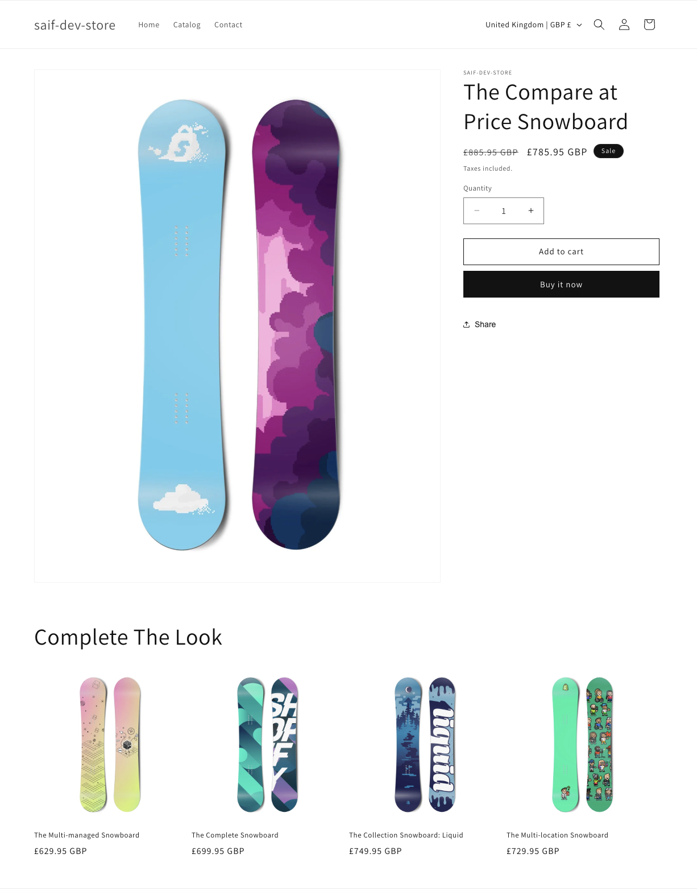

# Complete the Look, a Shopify section built on Dawn

This repo is Shopify's [Dawn](https://github.com/Shopify/dawn) reference theme plus one custom section I built: **Complete the Look**, a product recommendations section for product pages. The interesting part is the diff, not the theme:

Three files: `sections/complete-the-look.liquid`, `assets/complete-the-look.js`, `assets/section-complete-the-look.css`.

## Live demo

The section is running on a Shopify development store: **https://saif-dev-store-sxxnnjef.myshopify.com** (storefront password: `haslo`; development stores cannot remove the password wall). Open any product from the Catalog and scroll down.

## What it does

- Shows "goes well with this product" recommendations on product pages, driven by Shopify's native Product Recommendations API with the `intent=complementary` parameter. A merchant setting switches it to `related` intent.
- Merchant settings for heading, product count (2 to 8), image ratio, vendor and hover-image toggles, colour scheme and padding, in Dawn's own schema style. The section can only be added to product templates (`enabled_on`).

## The engineering choices

**Server-rendered cards, not JSON templating.** The JS fetches the recommendations URL with a `section_id`, which makes Shopify re-render this same Liquid section with the `recommendations` object populated, then swaps the HTML in. Liquid stays the single source of card markup and the section reuses Dawn's `card-product` snippet, so cards here look identical to cards everywhere else in the theme. The alternative, fetching `/recommendations/products.json` and building DOM in JS, duplicates the card markup in a second language and drifts out of sync with the theme.

**No layout shift.** On first render the section shows skeleton placeholder cards that occupy exactly the same grid cells as the real cards, sized by the same image-ratio setting. When the data arrives the cards replace the skeletons in place. If the API returns nothing, the whole section (wrapper and padding included) removes itself rather than leaving an empty band.

**Deferred loading.** An IntersectionObserver with a 400px root margin holds the fetch until the shopper scrolls near the section, so it costs nothing on page load.

**Reduced motion respected.** The skeleton shimmer and the loaded fade-in only run under `prefers-reduced-motion: no-preference`.

## Running it

1. `npm install -g @shopify/cli` (Node 22+; on Node 18 pin `@shopify/cli@3.68`)
2. `shopify theme dev --store your-dev-store` from the repo root
3. Add the "Complete The Look" section to a product template in the theme editor. Complementary intent needs the Shopify Search & Discovery app configured with complementary products; without it, switch the setting to related intent.

`shopify theme check` passes: zero offenses in the three files this repo adds (Dawn 16.0.0 itself ships 15 pre-existing warnings, untouched here).

## How I actually used AI on this

This is the first Liquid I have written. The build took under a day, working with Claude Code, I brainstormed the plan using a brainstorming skill, fine-tuned it, then implemented it with claude, and the commit history is the honest record: every commit carries a Claude co-author trailer because Claude Code wrote the first version of most lines, under direction and review.

What that looked like in practice:

- **The design decisions were made by reading Dawn's source first, not by generating code first.** My starting plan was the obvious one, fetch the JSON recommendations endpoint and template cards in JS. Reading `sections/related-products.liquid` and the `ProductRecommendations` element in `assets/global.js` showed Dawn's own pattern, section rendering with server-side Liquid, which is clearly better for markup consistency. The plan changed before the first line was written.
- **The tooling fought back and got fixed, not worked around.** `shopify theme check` would not run at first: the latest Shopify CLI requires Node 22 and this machine runs Node 18, failing with an unhelpful `enableCompileCache` import error. Pinning `@shopify/cli@3.68.0`, the last major version supporting Node 18, got a real lint pass instead of a skipped one.
- **Everything got verified against the theme, not assumed.** The `accessibility.loading` translation key, the `grid--N-col-desktop` classes and the `enabled_on` schema key were each confirmed to exist in Dawn 16 before being used; `intent=complementary` was confirmed as the same parameter Dawn's own complementary-products block passes in `main-product.liquid`.

The point of this repo, for the people I built it for: I had not touched Shopify before this. With Claude Code in the loop and the discipline to read the platform's reference code before trusting generated output, a day was enough to ship a section that follows the theme's conventions and passes its linter.

## License

Dawn is MIT licensed by Shopify (see LICENSE.md). The added section carries the same license.
